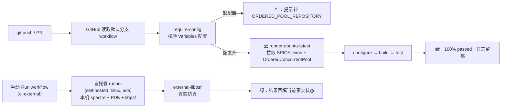

# CI/CD 学习笔记

状态：`active`（可持续追加）
最后更新：`2026-08-23`
适用范围：`GitHub Actions + SPICEUnion`

## 1. 核心概念

### CI / CD / 本地门禁

- **本地门禁（pre-commit gate）**：提交前在本机跑自动化验证。我们此前对 SPICEUnion
  的六预设 ctest 回归就是本地门禁——有“持续验证”的习惯，但没有机器部分。
- **CI（持续集成）**：每次 push / PR 由一台干净的机器自动拉代码、构建、跑测试，
  快速暴露集成问题。事实依据：GitHub Docs 定义 workflow 为“由一个或多个 job 组成
  的可配置自动化流程，由 YAML 文件定义，由仓库事件触发”。
- **CD（持续交付/部署）**：在 CI 之上自动产出可发布制品（wheel、二进制、release）。
- 一句话区分：本地门禁靠人自觉，CI 靠机器强制，CD 把“能跑”变成“能发”。

### GitHub Actions 词汇表

| 词 | 含义 |
|---|---|
| workflow | 一个自动化流程，对应一个 YAML 文件（`.github/workflows/`） |
| event | 触发条件：`push` / `pull_request` / `schedule` / `workflow_dispatch` |
| job | workflow 内的一次任务（可并行、可依赖） |
| step | job 内的一条具体命令或 action |
| runner | 执行 job 的机器（云托管或自托管） |
| action | 可复用的步骤包，如 `actions/checkout@v4` |
| artifact | job 结束后保存的产物（测试报告、构建结果） |
| cache | 跨运行复用的依赖/构建缓存 |
| secret | 仓库级加密变量（许可、token），日志中自动打码 |

## 2. 整体逻辑：从 push 到全绿（心智模型）

### 2.1 一句话模型

CI/CD = 把“你本来就会做的验证动作”写成**事件触发 + 机器选择 + 步骤 + 配置注入**
的声明式规则，交给 GitHub 在每次变更时自动执行、留痕、强制把关；EDA 部分因为许可
和材料只能在本机跑，就用自托管 runner 把本机接进同一个调度体系。

### 2.2 角色类比（工头与工人）

| 概念 | 类比 | 本项目中的具体物 |
|---|---|---|
| workflow | 流程卡：什么情况开工、派谁、按什么步骤 | `.github/workflows/*.yml` |
| runner | 工人 | 云 runner（干净机器）/ 自托管 runner（本机，label `eda`） |
| job / step | 一单活 / 活里的动作 | `require-config`、`build-test`、checkout / configure / build / test |
| event | 开工信号 | `push` / `pull_request` / `workflow_dispatch` / `schedule` |
| variables / secrets | 干活前的便签与钥匙 | `ORDERED_POOL_REPOSITORY` / `SPECTRE_MATERIALS_DIR` 等 |

核心：**workflow 是规则，配置是材料，runner 是人力，事件是触发。** CI 没有发明新
动作，只是把你手动跑的命令搬到另一台机器上、由事件自动触发、结果自动留痕。

### 2.3 运行故事线（云 CI）

1. push（或 PR）→ GitHub 读取仓库**默认分支**上的 workflow；
2. `require-config` 先校验材料（缺 `ORDERED_POOL_REPOSITORY` 直接红，提示补配置，
   不让后续步骤白跑）；
3. 云 runner（干净的 ubuntu）接单：拉 SPICEUnion → 按 Variables 拉
   `OrderedConcurrentPool` → configure → build → test；
4. 结果回到 GitHub：绿了留痕，红了留下日志——从此“绿了才提交”由机器强制。

### 2.4 为什么是“两级 + 本机脚本”

| 部分 | 存在原因 | 解决的问题 |
|---|---|---|
| 云 CI | 干净环境、push/PR 自动触发 | 证明“从零 clone 能构建”，集成问题早暴露 |
| 自托管 CI（本机） | 只有本机有 spectre 许可与材料 | 真实仿真必须真实跑，仍由 GitHub 调度留痕 |
| 本机一键脚本 | 开发时秒级自检 | 不等 CI，本地快速反馈 |

分工本质：**干净环境证明可复现，真实工具证明真能用，本机脚本提供日常手感。**

### 2.5 与本地验证的映射

```text
你的手  → cmake --preset → cmake --build → ctest
CI      → push 触发     → 同一套命令     → 在干净机器上跑 → 日志留痕
```

`scripts/verify_all_presets.sh` 把“你的手”脚本化；workflow 把脚本“搬到机器上并
自动触发”。所以学的不是陌生系统，而是“如何把手动验证声明成机器规则”。

### 2.6 流程图



## 3. 最小 workflow 示例（阶段 1 起点）

```yaml
name: ci-default
on:
  push:
  pull_request:
jobs:
  build-test:
    runs-on: ubuntu-latest
    steps:
      - uses: actions/checkout@v4
      - name: Configure
        run: cmake --preset default
      - name: Build
        run: cmake --build --preset default
      - name: Test
        run: ctest --preset default --output-on-failure
```

逐行要点：

- `on` 下的 `push` / `pull_request` 表示事件触发；二者都会跑，但语义不同
  （push 是提交后，PR 是合并前验证）。
- `runs-on` 选择 runner 镜像；`ubuntu-latest` 是最常用的云托管镜像。
- `uses: actions/checkout@v4` 把仓库代码拉到 runner；`@v4` 是 action 的版本 tag，
  建议锁定主版本。
- `run` 里的命令与本地 shell 一致；SPICEUnion 的 preset 设计让 CI 命令与本地
  完全复用。

## 4. SPICEUnion 的已知卡点（阶段 1 必踩）

- **OrderedConcurrentPool 不在 CI 环境**：默认构建要求 sibling 源树，需要
  `actions/checkout` 额外获取该仓库（或改用 submodule / install 包）。
- **外部预设不能上公共 runner**（建议）：`external` / `external-libpsf` 需要
  spectre 许可与 `spectre_materials/external` 材料，公共 runner 没有；方案是自托管
  runner + secrets。

## 5. 常见误区

- 把 CI 等同于“写了 YAML”：核心是“机器在干净环境强制重跑”，YAML 只是载体。
- `push` 与 `pull_request` 触发混用导致同一提交跑两遍：需要按分支策略选择。
- 在 CI 里依赖本机已有依赖/缓存：干净环境必须显式安装或 checkout。
- 把密钥写进 `run` 命令：必须用 `secrets` 并在日志中打码。

## 6. 待验证问题（随进度更新）

- [x] OrderedConcurrentPool 在 CI 中最稳的装配方式 → 显式 checkout 到
      `$GITHUB_WORKSPACE/OrderedConcurrentPool` + configure 显式
      `-DSPICEUNION_ORDERED_POOL_SOURCE_DIR` 注入（当前采用，2026-08-23 验证）。
- [ ] ccache / CMake 缓存的 key 设计（preset 变化时如何失效）。
- [x] external 预设的自托管 runner 独立 label → `eda`（已注册并验证接单）。
- [ ] 验证数字回填的最小实现（从 ctest 输出解析并写入文档）。
- [ ] `ci-eda-free` 云 CI 首次绿跑确认。
- [ ] libpsf 预设（`libpsf` / `python-libpsf-pic`）上云（阶段 2）。
- [ ] 拆分 spectre / ngspice 外部测试门控，让 ngspice 上云（阶段 2）。

## 7. 落地记录（2026-08-23）

### 采用的方案（业界主流折中，已确认）

| 层 | 执行位置 | 内容 | 触发 |
|---|---|---|---|
| 云 CI | GitHub 托管 runner | `default` / `python`（阶段 1）；libpsf 预设待阶段 2 | push + PR |
| 自托管 CI | 本机 runner（label `eda`） | `external-libpsf`（spectre + PDK + libpsf） | 手动 / 定时 |
| 本机脚本 | 本机 | `scripts/verify_all_presets.sh` 一键六预设 | 手动 |

### 已交付的仓库侧产物

- `.github/workflows/ci-eda-free.yml`：云 runner 流水线，matrix 覆盖 default / python；
  `OrderedConcurrentPool` 通过仓库变量 `ORDERED_POOL_REPOSITORY` 装配（sibling 依赖
  在干净环境的第一个卡点）。
- `.github/workflows/ci-external.yml`：自托管流水线，`runs-on: [self-hosted, linux, eda]`，
  仅手动/定时触发；`SPECTRE_MATERIALS_DIR`、`LIBPSF_INCLUDE_DIR`、`LIBPSF_LIBRARY`
  经 secrets 注入。
- `scripts/verify_all_presets.sh`：本机一键 configure/build/test 六个预设，
  已在本机实测跑通（全部通过）。

### workflow 逐段解读（学习要点）

- `on:`：`push` / `pull_request` / `workflow_dispatch` / `schedule`（cron 定时）；
- `needs:`：`build-test` 等 `require-config` 完成后才跑，先校验配置缺失并给出中文提示；
- `strategy.matrix`：一个 job 模板展开多个预设，互不阻塞（`fail-fast: false`）；
- `vars.` 与 `secrets.`：仓库级配置与机密，分别用于可公开变量和必须打码的路径/许可；
- `runs-on: [self-hosted, linux, eda]`：多个 label 是“且”关系，只有带 `eda` label
  的自托管 runner 能接这个 job。

### GitHub 侧待办清单（详细版，含原因与验证）

先理解一个背景：workflow 文件写在仓库里，但它引用的**仓库配置**（Variables、
Secrets、Runner）都存在于 GitHub 仓库设置里，而不是代码里。下面每一步都是在
“把 workflow 引用到的配置补全”，让流水线真正能跑。

#### 0. 前置：仓库可见性与 Actions 额度

- 把 SPICEUnion、OrderedConcurrentPool 各建为一个独立 GitHub 仓库；
- **Public vs Private**：公共仓库的云 runner 免费且无限量；自托管 runner 跑在
  你自己的机器上，公共仓库有“fork PR 可执行任意代码”的安全风险（GitHub 官方
  警告）。本项目 external workflow 已只开 `workflow_dispatch` / `schedule`，规避了
  大部分风险；如果你仍不放心，两个仓库保持 **Private** 也完全可以（GitHub Free
  私有仓库每月 2000 分钟 Actions 额度，对本项目足够）。

#### 1. 推送两个仓库

**怎么做**：分别在两个仓库目录执行

```bash
git remote add origin https://github.com/<owner>/<repo>.git
git push -u origin main
```

**为什么**：GitHub Actions 只对“托管在 GitHub 上的仓库”生效；workflow 文件必须在
**默认分支（main）** 上，push 事件才会读取并触发它。

**常见坑**：

- workflow 文件放错位置（必须是 `.github/workflows/*.yml`，且已提交）；
- 默认分支不是 `main`（如 `master`）时，push main 不触发；
- 仓库刚创建时 Actions 页是空的，push 之后才会出现第一个 workflow。

**怎么验证**：GitHub 仓库 Actions 页出现 `ci-eda-free` 工作流；或本地
`git ls-remote origin` 能看到远端分支。

#### 2. Variables：`ORDERED_POOL_REPOSITORY`

**怎么做**：Settings → Secrets and variables → Actions → **Variables** →
New repository variable：

```text
Name:  ORDERED_POOL_REPOSITORY
Value: <owner>/OrderedConcurrentPool   （例如 eda/OrderedConcurrentPool，不要带 https:// 或 .git）
```

**为什么**：`ci-eda-free.yml` 里用 `actions/checkout` 拉取 sibling 依赖，`repository`
参数来自 `${{ vars.ORDERED_POOL_REPOSITORY }}`。用 Variables 而不是写死，是为了
仓库属主变化、换人 fork 复用时不用改代码。

**常见坑**：

- 值带了 `https://github.com/` 或 `.git` 后缀 → checkout 解析失败；
- 没设置时，`require-config` job 会主动失败并输出中文提示（这是我们加的守卫）；
- Variables 是明文、可被 workflow 读取，只放非敏感信息。

**怎么验证**：跑一次 `ci-eda-free`，`require-config` 不再失败，`Checkout
OrderedConcurrentPool` 步骤能拉到仓库。

#### 3. Secrets：`SPECTRE_MATERIALS_DIR` / `LIBPSF_INCLUDE_DIR` / `LIBPSF_LIBRARY`

**怎么做**：Settings → Secrets and variables → Actions → **Secrets** →
New repository secret，填入自托管机器上的**绝对路径**：

```text
SPECTRE_MATERIALS_DIR = ~/my_lab/projects/spectre_materials
LIBPSF_INCLUDE_DIR    = ~/my_lab/projects/SPICEUnion/local/external/libpsf/install-pic/include
LIBPSF_LIBRARY        = ~/my_lab/projects/SPICEUnion/local/external/libpsf/install-pic/lib64/libpsf.a
```

（`lib64` 或 `lib` 以本机实际安装位置为准；建议统一指向 `install-pic`，因为
静态 libpsf 链接进 shared module 需要 PIC 构建，external-libpsf 用同一份最省心。）

**为什么**：

- 这些路径属于“机器环境细节”，且 `local/` 被 gitignore 不入库，CI 干净环境里
  不存在——必须由配置注入；
- Secrets 在日志中自动打码，避免机器路径/许可信息外泄（惯例是把“不该出现在
  公开日志里的东西”都走 Secrets）。

**常见坑**：

- Secrets 只在 job 运行时注入，不是持久环境变量；改完 Secrets 后新运行才生效；
- 路径含空格时 YAML 的 `-D...=${{ secrets.X }}` 展开会断——当前路径无空格，
  安全；以后有空格需要加引号；
- 值指向不存在的文件时，configure 阶段报 `FATAL_ERROR`（CMake 会提示找不到
  libpsf），先 `ls` 确认路径真实存在。

**怎么验证**：在 Actions 页手动触发 `ci-external`（workflow_dispatch），观察
Configure 步骤是否通过；日志里路径会被打码成 `***`，属正常现象。

#### 4. 注册自托管 runner 并添加 `eda` label

**怎么做**：

1. 仓库 Settings → Actions → **Runners** → New self-hosted runner → 选 Linux，
   页面会给一组命令；
2. 在**本机**下载 runner 包并执行：

```bash
./config.sh --url https://github.com/<owner>/<repo> --token <页面给的token> --labels eda
./run.sh
```

3. 长期运行建议装成系统服务：`sudo ./svc.sh install && sudo ./svc.sh start`。

**为什么**：`ci-external.yml` 的 `runs-on: [self-hosted, linux, eda]` 是**多 label
“且”关系**——runner 必须同时拥有这三个 label 才会被分配这个 job。默认 label 自带
`self-hosted`、`linux`；`eda` 需要注册时用 `--labels eda` 显式添加。

**常见坑**：

- runner 机器必须能访问 spectre license 服务器、PDK 材料、libpsf 安装——这些是
  机器能力，不是 GitHub 配置；
- `./run.sh` 在前台，关终端就掉线；务必装成服务；
- 公共仓库安全：自托管 runner 会执行分配给它的任何 job，所以 external job 只开
  手动/定时；云 job（`runs-on: ubuntu-latest`）永远不会打到自托管 runner；
- 一台机器可在不同目录注册多个 runner，但同一目录不要重复注册。

**怎么验证**：Settings → Actions → Runners 页面看到 runner **Online**（绿色），
并可查看它拥有的 labels。

#### 5. push 后观察首次运行并修失败

**怎么做**：推送 main（workflow 已随 `26c7aad` 进入仓库）→ Actions 页出现
`ci-eda-free` 运行 → 点进运行、点 job、逐个 step 看日志。

**预期首次失败点与排查顺序**（这是阶段 1 最好的实战教材）：

1. `require-config` 红：`ORDERED_POOL_REPOSITORY` 未设置 → 补 Variables；
2. `Checkout OrderedConcurrentPool` 红：变量格式错 / 仓库不存在 / 私有仓库无权限；
3. `Configure` 红：CMake 版本过低（ubuntu-latest 自带 3.28+，一般不是这个）、
   OCP 路径没落在 `../OrderedConcurrentPool`；
4. `python` preset 红：pybind11 走 FetchContent，网络拉取慢或失败，可重跑。

**修失败的方法论**：先看“哪个 step 红”→ 看该 step 的第一条 error → 对照 workflow
定义定位 → 改 workflow 后 push 新 commit 重跑（或 Actions 页 Re-run）。把每次失败
和根因记进本笔记的“错题/卡点记录”，避免重复踩。

**怎么验证**：所有 step 绿，Test step 输出 `100% tests passed`。

#### 6. 手动触发 external（可选，验证自托管链路）

Actions 页 → `ci-external` → **Run workflow**（workflow_dispatch 按钮）→ 选择
默认分支 → 运行。若本机 runner 在线且 Secrets 正确，`external-libpsf` 会真实跑
spectre 并输出 100% 通过。

### 已知限制 / 阶段 2 待办

- libpsf 预设（`libpsf` / `python-libpsf-pic`）需要先在 runner 上构建
  `henjo/libpsf`（本机 `local/external/libpsf` 不入库），matrix 再扩展；
- ngspice 外部测试上云需要先拆分 spectre / ngspice 门控（当前 external 预设
  configure 依赖 `spectre_materials/external` 材料）；
- 公共仓库使用自托管 runner 有任意代码执行风险（GitHub 官方警告）：只允许
  `push` 到 main / `workflow_dispatch` 触发，不用 `pull_request` 接自托管 job。

### 首次绿跑与服务化记录（2026-08-23）

**里程碑**：自托管 `ci-external` 端到端跑绿（external-libpsf：真实 spectre 仿真 +
BINPSF/PSFASCII 解析，105/105）。GitHub 调度 → 本机 runner → checkout →
configure → build → test 全链路打通。

**runner 信息**

| 项 | 值 |
|---|---|
| runner 名称 | `spiceunion-eda-runner` |
| labels | `self-hosted, Linux, X64, eda`（`eda` 供 workflow 匹配） |
| runner 版本 | 2.336.0 |
| 服务单元 | `actions.runner.Snappersontheprowl-SPICEUnion.spiceunion-eda-runner.service` |
| 运行用户 | `eda`（uid/gid 1000） |

**服务命令**

```bash
sudo ./svc.sh install   # 已执行成功（2026-08-23）
sudo ./svc.sh start     # 下一步：启动服务
sudo ./svc.sh status    # 查看状态
sudo ./svc.sh stop      # 停止
```

**本次踩坑复盘（错题记录）**

1. **runner group ≠ runner name**：组名用默认 `Default`（回车），名字才填
   `spiceunion-eda-runner`；labels 提示处必须补 `eda`；
2. **隐式相对路径依赖**：CMake 默认 `../OrderedConcurrentPool` 在 CI 干净环境里
   不成立 → configure 显式注入 `-DSPICEUNION_ORDERED_POOL_SOURCE_DIR`；
3. **checkout 假绿陷阱**：`ORDERED_POOL_REPOSITORY` 未设置时，checkout 会把当前
   仓库拉进目标路径（目录“存在”但内容错）→ 用 OCP 标记文件
   `include/ocp/ordered_concurrent_pool.hpp` 做校验步骤；
4. **Node 20 弃用警告**：`actions/checkout` v4 → v5（Node 24 运行时，要求 runner
   ≥ 2.327.1，当前 2.336.0 满足）。

**待确认项**

- `ci-eda-free`（云 CI）是否也首次跑绿；
- 07:28 失败 → 07:39 成功之间改了什么（若已知，补进复盘）。
