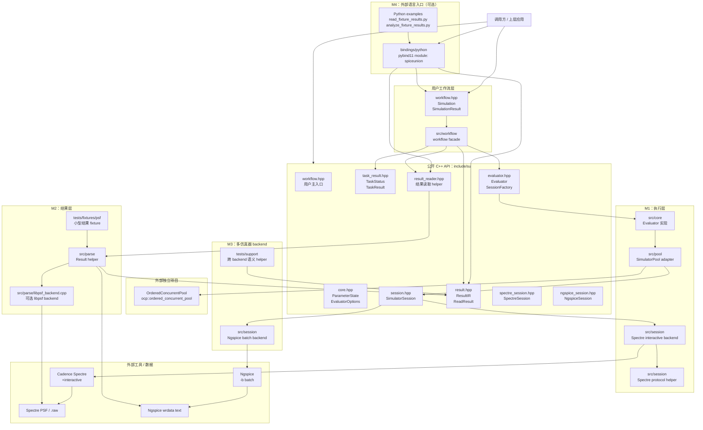
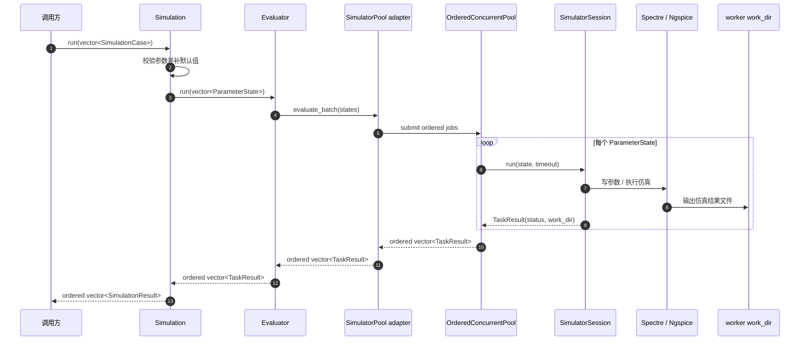
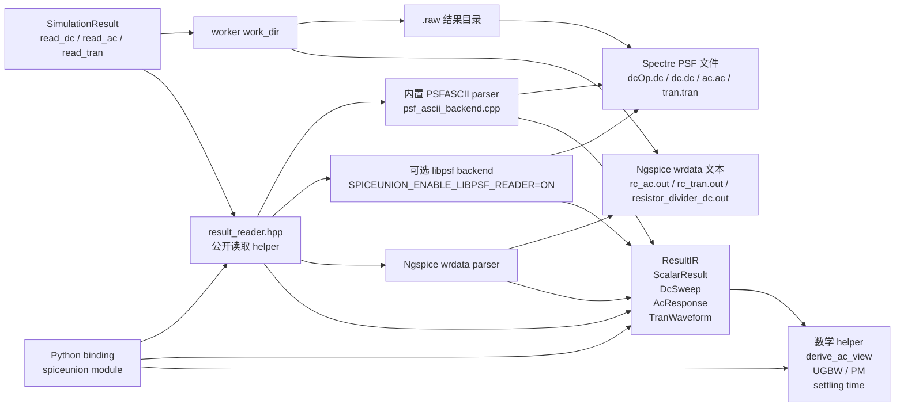
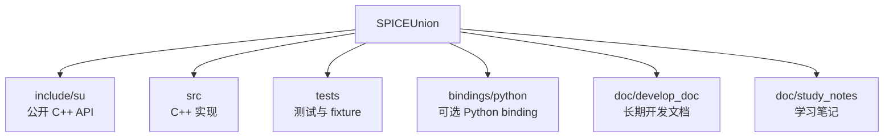
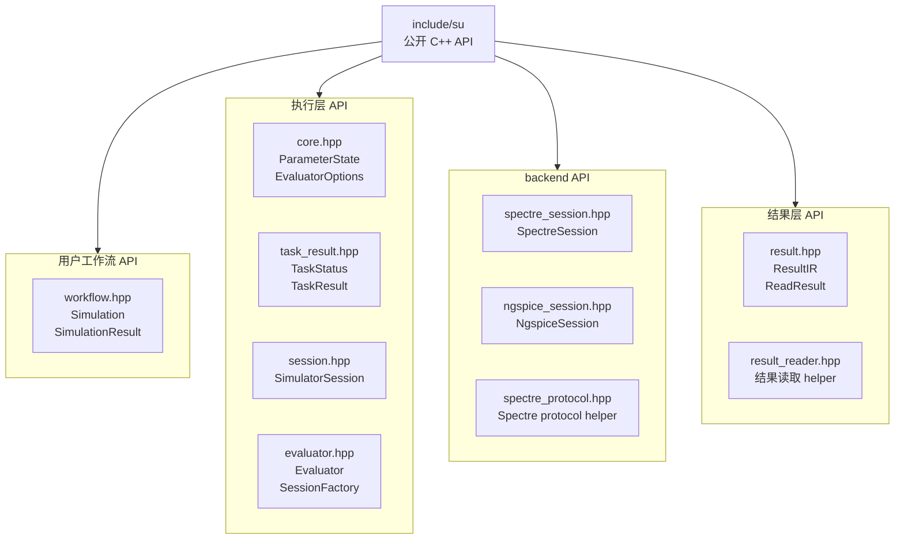
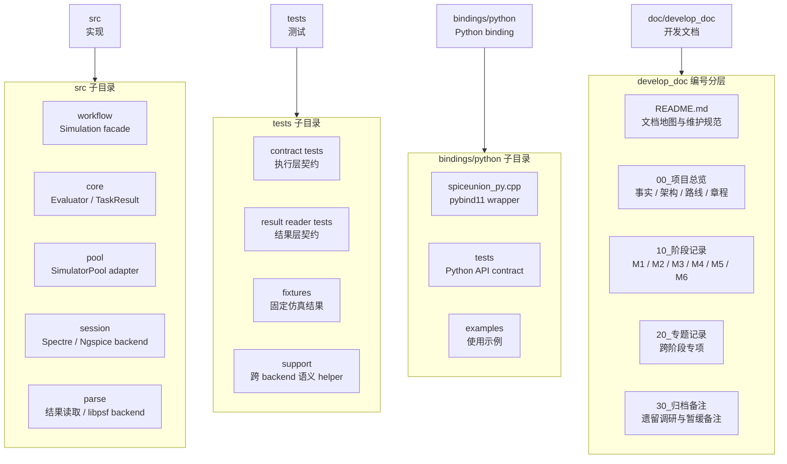

# SPICEUnion 架构总览

更新时间：2026-09-02

本文用图说明 SPICEUnion 当前架构。图使用 Mermaid 保存为 Markdown 源码，便于版本管理和后续维护。

当前阅读顺序建议：

1. 先看总体分层架构图，理解 workflow、M1 / M2 / M3 / M4 的位置。
2. 再看执行链路图，理解 `Simulation` batch 如何跑到 simulator。
3. 再看结果读取链路图，理解结果文件如何变成 ResultIR / Python 对象。
4. 最后看模块责任图，理解目录和公开头文件的职责。

## 1. 总体分层架构图

这张图回答：

- SPICEUnion 当前有哪些层；
- workflow、M1 / M2 / M3 / M4 分别负责什么；
- OrderedConcurrentPool 与 SPICEUnion 的关系；
- Python binding 是否属于 core。

核心结论：

- M1 负责执行；
- M2 负责结果读取；
- M3 负责多 backend 和语义对照；
- M4 负责可选 Python 入口；
- 用户工作流层负责普通用户主路径，内部复用 M1 执行层和 M2 结果层；
- OrderedConcurrentPool 是独立项目，SPICEUnion 通过 `SimulatorPool` adapter 装配。

## 2. 执行链路图

这张图回答：

- 一个 `SimulationCase` batch 如何从调用方进入 simulator；
- 为什么 `TaskResult` 只返回执行状态和 `work_dir`；
- 为什么结果解析不在 `Evaluator` 里，而由 `SimulationResult` / reader 负责。

执行层边界：

- `Evaluator` 保证 batch 输出和输入等长同序；
- `Simulation` 在启动 evaluator 前校验用户参数声明并补默认值；
- 每个 worker 使用独立 `work_dir`；
- 单任务失败只影响对应 `TaskResult`；
- `TaskResult` 不承载 waveform、metric、objective 或 score；
- 普通调用方通过 `SimulationResult.read_*()` 进入结果读取链路；高级调用方仍可查看
  `work_dir`。

## 3. 结果读取链路图

这张图回答：

- 仿真结束后，结果文件如何变成 C++ ResultIR；
- libpsf 在哪里；
- Python binding 包装了什么；
- `SimulationResult` 如何隐藏 result directory 主路径细节；
- Ngspice 文本结果如何进入同一套 ResultIR。

结果层边界：

- 结果格式是执行契约的一部分：执行层交付 `TaskResult.result_format`
  （`ResultFormat`），解析层声明优先、`kUnknown` 才按文件内容嗅探分发；
- PSFASCII 走内置 parser（默认可用），BINPSF 走可选 libpsf backend；
- libpsf 是内部可选 backend，公开 API 不暴露 libpsf 类型；
- `SimulationResult` 自动使用 `TaskResult.work_dir` 与 `TaskResult.result_format` 调用结果读取层；
- Python binding 不重新实现解析逻辑，只包装 C++ `result_reader.hpp` 和 ResultIR；
- `ReadResult<T>` 明确表达成功、失败状态和错误消息；
- 读取失败不能伪装成 `0.0`、空数组或 `None`。

## 4. 模块责任图

原先把目录、公开头文件、测试、binding 和文档全部放在一张图里，横向节点过多，Markdown 渲染时容易被压缩得很小。

这里拆成三张小图：

- 仓库主要目录分别负责什么；
- `include/su` 中各公开头文件对应哪类职责；
- 测试、binding、文档在项目中的位置。

### 4.1 顶层目录责任图

顶层目录边界：

- `include/su` 是公开 C++ API；
- `src` 是 C++ 实现；
- `tests` 保存测试与 fixture；
- `bindings/python` 是可选语言绑定，不反向影响默认 C++ 构建；
- `doc/develop_doc` 保存长期有效开发文档。

### 4.2 公开 C++ API 头文件责任图

公开头文件边界：

- 用户工作流 API 是普通用户主入口，内部复用执行层和结果层；
- 执行层 API 只描述输入、执行配置、session 生命周期与任务状态；
- backend API 暴露具体 Spectre / Ngspice backend 入口；
- 结果层 API 描述 ResultIR、读取状态和结果读取 helper；
- 公开头文件不暴露 libpsf 类型。

### 4.3 实现、测试、binding 与文档责任图

实现与文档边界：

- `src/core` 和 `src/pool` 是执行层实现；
- `src/workflow` 是普通用户工作流 facade 实现；
- `src/session` 拥有外部 simulator process/protocol 细节；
- `src/parse` 拥有结果读取实现；
- `tests/support` 保存跨 backend 可复用语义 helper；
- `bindings/python/examples` 保存可回归的最小使用示例；
- `doc/develop_doc` 按编号目录维护当前事实、当前架构、路线、阶段记录、专题和归档备注。

## 5. 阶段文档对应关系

| 阶段 | 架构位置 | 责任文档 |
|---|---|---|
| M1 | 执行层 | `../10_阶段记录/01_M1_Spectre执行层.md` |
| M2 | 结果层 | `../10_阶段记录/02_M2_ResultIR与结果读取.md` |
| M3 | 多 backend 与跨 backend 语义对照 | `../10_阶段记录/03_M3_多仿真器与语义收敛.md` |
| M4 | Python binding / C ABI 评估 | `../10_阶段记录/04_M4_语言绑定.md` |
| M5 | 用户工作流 API | `../10_阶段记录/05_M5_用户工作流API.md` |
| M6 | Python workflow binding | `../10_阶段记录/06_M6_Python工作流Binding.md` |

## 6. 当前不表达的内容

这些图只表达当前已完成或明确装配的架构，不表达以下暂缓方向：

- 完整 netlist IR；
- optimizer；
- circuit metric / objective / penalty；
- 原生 PSF parser；
- Python workflow binding 的 Spectre 真实 workflow smoke；
- MATLAB binding 或 CLI bridge；
- C ABI 正式实现；
- Xyce / Hspice backend；
- MOS I-V / gm/Id 多曲线结果。

若上述方向后续进入正式开发，应同步更新本文。
