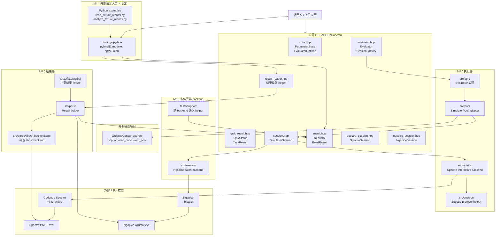
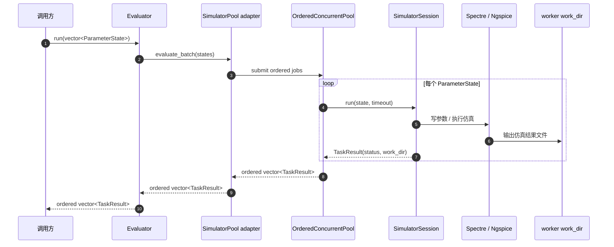
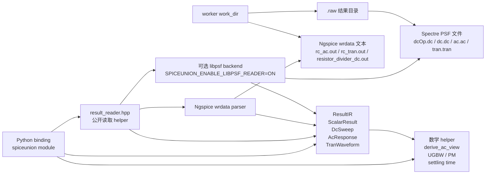

# SPICEUnion 架构总览

更新时间：2026-08-13

本文用图说明 SPICEUnion 当前架构。图使用 Mermaid 保存为 Markdown 源码，便于版本管理和后续维护。

当前阅读顺序建议：

1. 先看总体分层架构图，理解 M1 / M2 / M3 / M4 的位置。
2. 再看执行链路图，理解 batch 如何跑到 simulator。
3. 再看结果读取链路图，理解结果文件如何变成 ResultIR / Python 对象。
4. 最后看模块责任图，理解目录和公开头文件的职责。

## 1. 总体分层架构图

这张图回答：

- SPICEUnion 当前有哪些层；
- M1 / M2 / M3 / M4 分别负责什么；
- OrderedConcurrentPool 与 SPICEUnion 的关系；
- Python binding 是否属于 core。

核心结论：

- M1 负责执行；
- M2 负责结果读取；
- M3 负责多 backend 和语义对照；
- M4 负责可选 Python 入口；
- OrderedConcurrentPool 是独立项目，SPICEUnion 通过 `SimulatorPool` adapter 装配。

## 2. 执行链路图

这张图回答：

- 一个 batch 如何从调用方进入 simulator；
- 为什么 `TaskResult` 只返回执行状态和 `work_dir`；
- 为什么结果解析不在 `Evaluator` 里。

执行层边界：

- `Evaluator` 保证 batch 输出和输入等长同序；
- 每个 worker 使用独立 `work_dir`；
- 单任务失败只影响对应 `TaskResult`；
- `TaskResult` 不承载 waveform、metric、objective 或 score；
- 调用方拿到成功的 `work_dir` 后，再进入结果读取链路。

## 3. 结果读取链路图

这张图回答：

- 仿真结束后，结果文件如何变成 C++ ResultIR；
- libpsf 在哪里；
- Python binding 包装了什么；
- Ngspice 文本结果如何进入同一套 ResultIR。

结果层边界：

- libpsf 是内部可选 backend；
- 公开 API 不暴露 libpsf 类型；
- Python binding 不重新实现解析逻辑，只包装 C++ `result_reader.hpp` 和 ResultIR；
- `ReadResult<T>` 明确表达成功、失败状态和错误消息；
- 读取失败不能伪装成 `0.0`、空数组或 `None`。

## 4. 模块责任图

这张图回答：

- 仓库主要目录分别负责什么；
- `include/su` 中各公开头文件对应哪类职责；
- 测试、binding、文档在项目中的位置。

```mermaid
flowchart TB
    Root["SPICEUnion"]

    Root --> Include["include/su<br/>公开 C++ API"]
    Root --> Src["src<br/>实现"]
    Root --> Tests["tests<br/>测试与 fixture"]
    Root --> Bindings["bindings/python<br/>可选 Python binding"]
    Root --> Docs["doc/develop_doc<br/>开发文档"]
    Root --> Study["doc/study_notes<br/>学习笔记"]

    Include --> CoreH["core.hpp<br/>输入参数与配置"]
    Include --> TaskH["task_result.hpp<br/>执行结果状态"]
    Include --> SessionH["session.hpp<br/>仿真器生命周期抽象"]
    Include --> EvalH["evaluator.hpp<br/>batch 执行门面"]
    Include --> ResultH["result.hpp<br/>ResultIR"]
    Include --> ReaderH["result_reader.hpp<br/>结果读取 API"]
    Include --> SpectreH["spectre_session.hpp<br/>Spectre backend"]
    Include --> NgspiceH["ngspice_session.hpp<br/>Ngspice backend"]

    Src --> CoreSrc["core<br/>Evaluator / TaskResult"]
    Src --> PoolSrc["pool<br/>SimulatorPool adapter"]
    Src --> SessionSrc["session<br/>Spectre / Ngspice 实现"]
    Src --> ParseSrc["parse<br/>结果读取 / libpsf backend"]

    Tests --> ContractTests["contract tests<br/>执行层契约"]
    Tests --> ResultTests["result reader tests<br/>结果层契约"]
    Tests --> FixtureTests["fixtures<br/>固定仿真结果"]
    Tests --> SemanticTests["support<br/>跨 backend 语义 helper"]

    Bindings --> PyCpp["spiceunion_py.cpp<br/>pybind11 wrapper"]
    Bindings --> PyTests["tests<br/>Python API contract"]
    Bindings --> PyExamples["examples<br/>使用示例"]

    Docs --> M1["M1.md<br/>执行层"]
    Docs --> M2["M2.md<br/>结果读取"]
    Docs --> M3["M3.md<br/>多 backend"]
    Docs --> M4["M4.md<br/>Python / C ABI"]
```

模块责任边界：

- `include/su` 是公开 C++ API；
- `src/core` 和 `src/pool` 是执行层实现；
- `src/session` 拥有外部 simulator process/protocol 细节；
- `src/parse` 拥有结果读取实现；
- `bindings/python` 是可选语言绑定，不反向影响默认 C++ 构建；
- `doc/develop_doc` 保存长期有效开发文档。

## 5. 阶段文档对应关系

| 阶段 | 架构位置 | 责任文档 |
|---|---|---|
| M1 | 执行层 | `M1.md` |
| M2 | 结果层 | `M2.md` |
| M3 | 多 backend 与跨 backend 语义对照 | `M3.md` |
| M4 | Python binding / C ABI 评估 | `M4.md` |

## 6. 当前不表达的内容

这些图只表达当前已完成或明确装配的架构，不表达以下暂缓方向：

- 完整 netlist IR；
- optimizer；
- circuit metric / objective / penalty；
- 原生 PSF parser；
- Python `Evaluator` / session binding；
- C ABI 正式实现；
- Xyce / Hspice backend；
- MOS I-V / gm/Id 多曲线结果。

若上述方向后续进入正式开发，应同步更新本文。
